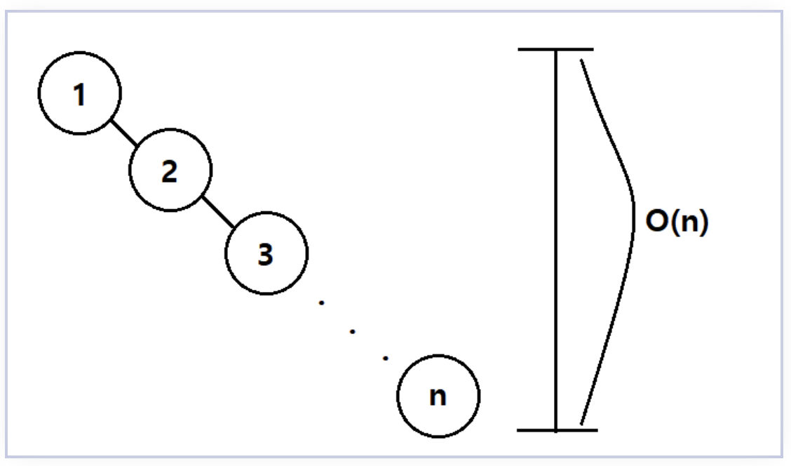
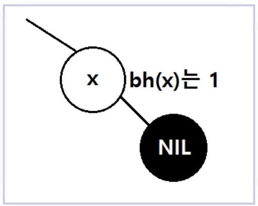
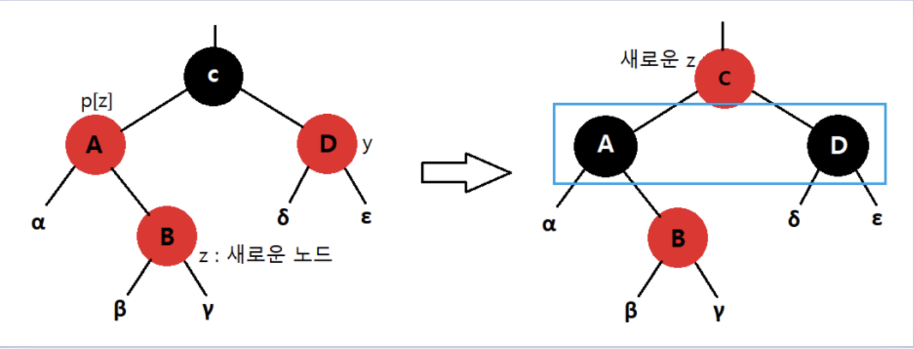
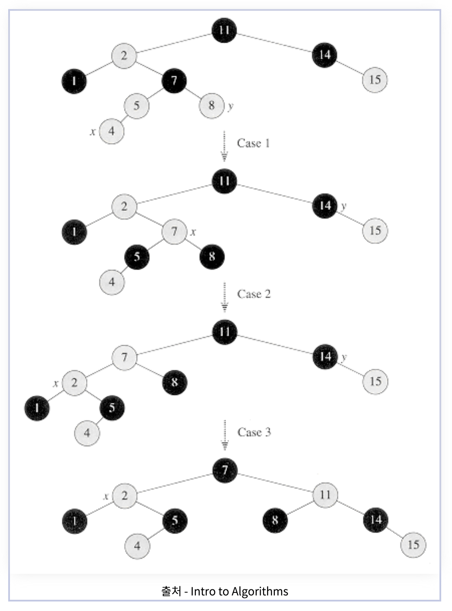

# Red-Black Tree : 레드 블랙 트리

### 레드 블랙 트리
레드 블랙 트리는 binary-search tree(이진탐색트리)의 일종이다.  
기존의 이진 탐색트리 같은 경우 input이 이미 정렬되어있다면 높이가 n이 되버리고, 다라서 시간복잡도 또한 O(n)에 도달하게 된다.



하지만 레드 블랙 트리의 경우 특정 조건을 지키면서 균형잡힌 이진트리가 되기때문에 Search, Insert, Delete연산을 최악의 경우에도 O(logN) 시간안에 가능하도록 해준다.  
  
이번 정리 내용은 다음과 같다.

1. NIL node의 설명
2. Red-Black tree의 정의
3. Red-Black tree의 높이
4. Left and Right rotation
5. Insert 연산과 case 분류
6. Delete 연산과 case 분류

<br>

### NIL node
우선 Red-Black tree를 설명하기 전에 NIL node에 대하여 정의하고 시작하자.  
  
NIL node는 자식노드가 존재하지 않는 경우 NIL node라는 특수한 노드가 있다고 생각하자.  
따라서 모든 leaf node는 NIL node가 된다. 또한 root의 부모도 NIL node라고 가정하자. 노드들은 내부노드와 NIL node로 나뉜다.

그림으로 보면 다음과 같다.


<br>

### Red-Black Tree의 정의
다음 5가지 조건을 만족하는 이진탐색트리를 Red Black Tree라고 부른다.

1. 각 노드의 색은 red or black 이다.
2. root 노드는 black이다.
3. 모든 단말노드(leaf node)는 전부 black이다. (NIL이 black이 된다.)
4. red 노드의 자식노드들은 전부 black이다. (즉, red 노드는 연속되어 등장할 수 없다.)
5. Root 노드에서 시작해서 자손인 leaf노드에 이르는 모든 경로에는 동일한 개수 black노드가 조재한다.


위의 그림에서

- case 1 : 13(b) -> 8 -> 11(b) -> NIL(b): 총 3개의 black 노드를 거침  
- case 2 : 13(b) -> 8 -> 1(b) -> NIL(b) : 총 3개의 black 노드를 거침  
- case 3 : 13(b) -> 17 -> 25(b) -> 22 -> NIL(b) : 총 3개의 black 노드를 거침

root에서 NIL 까지 가는 경로상에서 만난 black 노드의 수가 같은 것 이기 때문에 3으로 같다.  
  
이를 case를 보면 경로를 통해 내려가는 동안 거친 black 노드의 수가 3개로 동일하다. 물론 몇가지 case가 더 있지만 생략하겠다. 이들 또한 동일함

<br>

### Red-Black Tree의 높이 
높이를 2가지로 구분해볼 수 있다.

1. h(x)는 x 자신으로부터 leaf 노드 까지의 가장 긴 경로에 포함된 edge(간선)의 수다.
2. bh(x)는 x로부터 leaf노드 까지의 경로상의 black 노드의 개수이다. (자기 자신 x는 빼고 count한다.)

다음 그림을 통해 확인해보자.


- 높이가 h인 노드의 bh는 bh >= h/2 이다.
  - 조건 4에 의해 red노드는 2개가 연속해서 올 수 없다. red가 나오면 바로 black이 나와야 하니까 black노드의 수가 적어도 절반 이상이 되어야하는 것이다.
- 노드 x를 root로 하는 임의의 subtree는 적어도 2^bh(x) - 1개의 내부 노드를 포함한다.

예를 들어 다음 그림과 같은 노드 x가 있다고 해보자.


bh(x)가 1이라는 말은 자기 자신 x는 빼고 black node의 수를 카운트하니 NIL노드 딱 하나 있다는 말이다.  
이는 x 자기 자신을 subtree의 내부 노드로 갖고잇는 상황이다.  
  
이를 수학적 귀납법을 이용하면 tree 전체에 적용가능함을 알 수 있다.

- n개의 내부 노드를 갖는 red-black tree 높이는 2log(n+1)이하이다.
  -  한 트리의 총 노드의 수 n은 바로 위에서 배운 x를 루트로 하는 subtree의 노두의 수 (2^bn-1)보다는 크거나 같다.
  -  또한 bh는 바로 위에서 확인했듯 bh>=h/2이다. 따라서 다음과 같은 식이 성립한다.
  -  n >= 2^bh-1 >= 2^k/2 - 1
  -  여기서 높이 h를 유도할 수 있다.


따라서 높이는 최대 2log(n+1)이며, 시간 복잡도 O(logN)을 보장한다.

<br>

### Left and Right Rotation

그림을 통해 한번에 확인 가능하다.


시간 복잡도는 O(1) 이며, 이진 탐색트리의 특성을 그대로 유지한다.

```js

Left-Rotate(T,x)
y <- right[x] // set y
right[x] <- left[y] // x의 오른쪽 자식을 y의 왼쪽 자식으로 지정
p[left[y]] <- // B의 부모를 y에서 x로 변경
p[y] <- p[x] // x의 부모가 y의 부모노드가 됨
if p[x] = nil[T] // 만약 x의 부모가 NIL이라면, 즉 x가 root라면
    then root[T] <- // y가 새로운 tree의 root 가 됨.
    else if x = left[p[x]] // x가 x의 부모의 왼쪽 자식이라면
    then left[p[x]] <- y // y가 x부모의 왼쪽 자식이 되고
    else right[p[x]] <- y // y가 x부모의 오른쪽 자식이 되고

left[y] <- x // x와 y를 연결
p[x] <- y
```

<br>

### Insert

새로 삽입할 노드 z를 red로 칠해준다.  
  
삽입이후 우리의 tree는 RB tree의 조건 5가지를 만족해야 한다. 이를 확인해보자.
1. 성립한다.
2. 만약 z가 root 노드라면 위반, 아니면 조건2는 성립한다.
새로 추가한 노드는 red니까 보통의 경우에는 성립한다. 하지만, 원래 tree가 비어있는 경우 red가 root위치하게 된다. 이럴 때는 간단하게 그냥 root를 black으로 변경해주면 끝난다.

3. 성립한다.
4. 문제가 된다! 새로 삽입한 z의 부모 y가 black이면 상관없지만, red면 ㅁ조건 위반이다. 다음 그림처럼 말이다.


이런 red-red 충돌을 수정해주기 위해서 추가적인 RB-Insert_Fixup 이라는 함수를 호출해줘야 한다.
5. 성립한다.

- RB-Insert_Fixup의 구현
우선 RB-Insert_Fixup가 언제 종료되고, 언제 필요한지를 확인해보자

- 필요한 경우
  - 조건 2 위반, z가 root 이면서 red인 경우.
  - 조건 4 위반, z와 그 부모 p[z]가 둘다 red인 경우.
- 종료 조건
   - 부모노드 p[z]가 black이면 종료한다. 조건 2가 위반될 경우 z를 그냥 black으로 변경해주면 긑난다.
총 3가지 case가 insert에서 존재하게 된다.  
참고로 case1,2,3은 모두 p[z]\(아버지)가 p[p[z]]\(할아버지)의 왼쪽 자식인 경우들이다.  
case 456은 p[z]가 p[p[z]]의 오른쪽 자식인 경우로, 그냥 좌우만 바꿔주면 된다. 따라서 case 123만 설정하겠다.

#### case 1 : z의 삼촌 y가 red인 경우


B노드가 우리가 새롭게 삽입한 z이다. 이 z는 A의 오른쪽 자식일수도 있고 왼쪽 자식일수도 있다.  
  
위의 그림에서 A B가 red-red 충돌이 발생하고있고 z의 삼촌 y(D)가 red인 상황이다.  
  
이는 A and D를 black으로, 할아버지 C는 red로 변경해주면 A,B의 red-red 충돌은 해결이 되었다.  
하지만 완벽한 해결이 아니다. 왜냐하면 할아버지 노드인 C가 red가 되면 p[c]와 red-red 충돌이 발생할 수 있기 때문이다.  
  
다만 이렇게 색을 변경해주면 red-red 충돌의 문제가 위로 2칸 이동해 있음을 알 수 있다.  
즉, A-B문제가 C-p[C] 간의 문제로 이동하였다. 이렇게 쭉 root 까지 이동하게 되면 결국 마지막에는 root의 색만 black으로 변경해주면 끝나버린다.  
  
또한 조건 5인 black height 또한 바뀌지 않는다. 색 변경 전이나, 변경 후 모두 NIL노드 까지 가는 경로의 black node의 수는 동일하다. C위에서 오던 중이라고 생각하고 아래로 내려가면서 black의 수를 새어보면 똑같다.  
  
참고로 abyoe 의 경우 부모가 red이니까 이들은 black이다. 연속된 red는 불가능하니 이는 당연하다.

#### case 2,3 : z의 삼촌 y가 Black인 경우


삼촌 y는 NIL node도 가능하기 때문에 검정 동그라미로 표현하지 않았다 어찌됐든 black이라고 생각하면 된다.

- case 2 : z가 오른쪽 자식인 경우
  - p[z]\(B)를 black, p[p[z]]\(C)를 red로 바꿈, 이후 p[p[z]]\(C)에 대하여 right-rotation을 진행. 최종 결과가 나온다.


#### Insert의 시간 복잡도
RB-Insert_Fixup
case1의 경우 z가 2 level 만큼 상승한다. case2, 3의 경우 상수시간이 걸린다. 따라서 트리의 높이에 비례하는 시간이 걸린다.  
  
왜냐하면 최악의 경우 case1이 반복되어 root까지 red-red충돌을 올려야 할 수도 있다. 최정족으로 root 까지 도달하면 root의 색만 black으로 변경해주면 된다. 따라서 최악의 경우는 높이에 해당할 것이다.  
  
시간 복잡도는 O(logN)에 해당하게 된다.  
  
마지막으로 Insert의 예시를 확인해보자. 흰색 노드가 red이다.



<br>

### DELETE

예를 들어보자 successor라는 함수는 삭제할 y의 바로 다음값, 즉 트리으 ㅣ원소들을 오름차순으로 배열했을 때 y 바로 값을 의미.

tree의 모든 원소들을 오름차순으로 배열했을때 1,2,5,7(y),8,11 순으로 있다면 y의 successor는 8에 해당한다.  
  
실제로 삭제된 노드가 y가 red였다면 그냥 종료하면된다. red는 연속할 수 없으니, red의 자식과 부모는 black일 것 이며 따라서 중간의 red를 지워도 black-black의 연속은 문제되지 않는다.  
  
하지만 y가 black였다면 RB-Delete-Fixup을 호출해줘야한다. 이는 다음 그림을 보면 좀 더 이해갈 것이다.