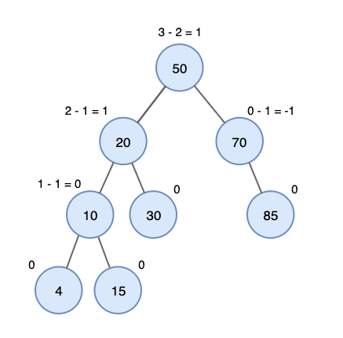
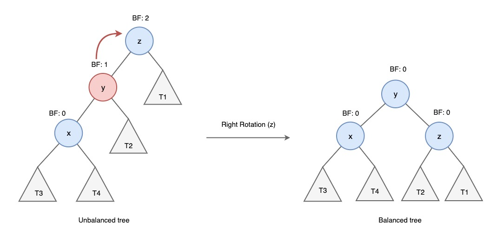
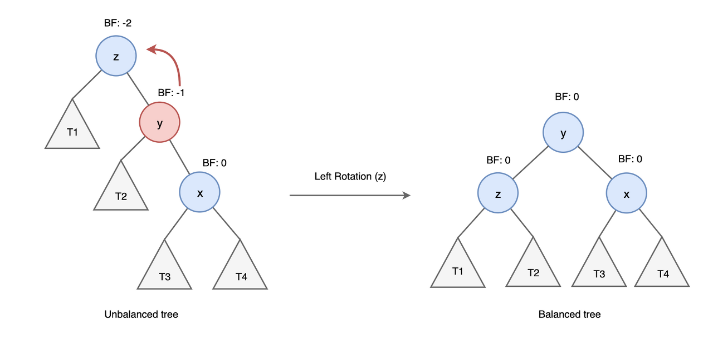
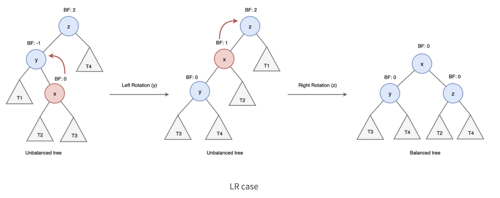

# AVL Tree

### AVL Tree란?
AVL 트리는 스스로 균형을 잡는 이진 탐색 트리입니다.  
  
트리의 높이가 h일 때 이진 탐색 트리의 시간 복잡도는 O(h)입니다.  
한쪽으로 치우친 편향 이진트리가 되면 트리의 높이가 높아지기 떄문에 이를 방지하고자 높이 균형을 유지하는 AVL 트리를 사용하게 됩니다.  
  
AVL트리는 다음과 같은 특징을 가집니다.
- AVL 트리는 이진 탐색 트리의 속성을 가집니다.
- 왼쪽, 오른쪽 서브 트리의 높이 차이가 최대 1입니다.
- 어떤 시점에서 높이 차이가 1보다 커지면 회전을 통해 균형을 잡아 높이 차이를 줄입니다.
- AVL 트리는 높이를 logN으로 유지하기 떄문에 삽입, 검색, 삭제의 시간 복잡도는 O(logN)입니다.

### Balance Factor BF

Balance Factor는 왼쪽 서브트리의 높이에서 오른쪽 서브트리의 높이를 뺀 값 입니다.

- BF가 1이면 왼쪽 서브트리가 오른쪽 서브트리보다 높이가 한단계 높다는 것을 의미합니다.
- BF가 0이면 왼쪽 서브트리와 오른쪽 서브트리의 높이가 같다는 것을 의미합니다.
- BF가 -1이면 왼쪽 서브트리가 오른쪽 서브트리보다 높이가 한단계 낮다는 것을 의미합니다.

다음은 AVL 트리의 예입니다. BF가 -1과 +1 사이에 있음을 알 수 있습니다.



<br>

### 시간 복잡도

AVL의 트리 높이를 logN으로 유지하기 때문에 삽입, 검색, 삭제의 시간 복잡도는 O(logN)입니다.

### 회전

AVL트리는 이진 탐색 트리이기 때문에 모든 작업은 이진 탐색 트리에서 사용하는 방식으로 수행됩니다.  
  
삽입 삭제시 불균형 상태(BF가 -1 0 1이 아닌 경우) 가 되면 AVL 트리는 불균형 노드를 기준으로 서브트리의 위치를 변경하는 rotation 작업을 수행하여 트리의 균형을 맞추게 됩니다.  
  
삽입 삭제시 노드들의 배열에 따라 4가지 (LL, RR , LR , RL) 불균형이 발생할 수 있으며 각 상황마다 rotation에 방향을 달리하여 트리의 균형을 맞춥니다.  

#### LL Left Left Case

y는 z의 왼쪽 자식 노드이고, x는 y의 왼쪽 자식 노드인 경우 right rotation을 수행하여 균형을 맞춥니다.
  
right rotation 수행 과정
- y노드의 오른쪽 자식 노드를 z노드로 변경합니다.
- z노드의 왼쪽 자식 노드를 y노드 오른쪽 서브트리로 변경합니다.
- y는 새로운 루트 노드가 됩니다.



#### Right Rotation 구현

```c
struct node *rightRotate (struct node *z) {
  struct node *y = z->left;
  struct node *T2 = y->right;

// right 회전 수행
  y->right = z;
  z->left = T2;

// 노드 높이 갱신
  z->height = 1 + max(z->left->height, z->right->height);
  y->height = 1 + max(y->left->height, y->right->height);

// 새로운 루트 노드 y를 반환  
  return y;
}
```

<br>

#### RR Right Right Case
y는 z의 오른쪽 자식 노드이고, x는 y의 오른쪽 자식 노드인 경우 left rotation을 수행하여 균형을 맞춥니다.

left rotation 수행 과정
- y노드의 왼쪽 자식 노드를 z노드로 변경합니다.
- z노드 오른쪽 자식 노드를 y노드 왼쪽 서브트리로 변경합니다.



#### Left Rotation 구현

```c
struct node *leftRotate (struct node *z) {
  struct node *y = z->right;
  struct node *T2 = y->left;

// left 회전 수행
  y->left = z;
  z->right = T2;

// 노드 높이 갱신
  z->height = 1 + max(z->left->height, z->right->height);
  y->height = 1 + max(y->left->height, y->right->height);

// 새로운 루트 노드 y를 반환  
  return y;
}
```

#### Left Right LR Case
y는 z의 왼쪽 자식 노드이고 x는 y의 오른쪽 자식 노드인 경우 Left Right 순으로 총 두번의 rotation을 수행하여 균형을 맞춥니다.



#### 구현

```java
y = z->left;
y = leftRotate(y);
z = rightRotate(z);
```

### RL Right Left case
y는 z은 오른쪽 자식 노드이고, x는 y의 왼쪽 자식 노드인 경우, right left 순으롷 총 두번에 rotation을 수행하여 균형을 맞춥니다.


#### 구현
```
y = z->right;
y = rightRotate(y);
z = leftRotate(z);
```

